<h4 align="center">安全服务集成化工具集</h4>

<a href="https://github.com/qiwentaidi/Slack/wiki/%E5%B8%B8%E8%A7%81%E9%97%AE%E9%A2%98">常见问题</a>
<a href="https://github.com/qiwentaidi/Slack/wiki/%E7%BD%91%E7%AB%99%E6%89%AB%E6%8F%8F%E8%A7%84%E5%88%99%E4%BA%8C%E6%AC%A1%E6%8B%93%E5%B1%95">规则拓展</a>
<a href="https://github.com/qiwentaidi/Slack/wiki/%E4%BA%8C%E6%AC%A1%E5%BC%80%E5%8F%91">二次开发</a>
<a href="https://github.com/qiwentaidi/Slack/wiki">支持平台/运行代码</a>

## 网站扫描

目前内置8500+指纹，3400+POC，引擎使用的Nuclei v3，得益于Nulcei强大的社区及丰富的POC易用可扩展，以及多种格式报告导出。

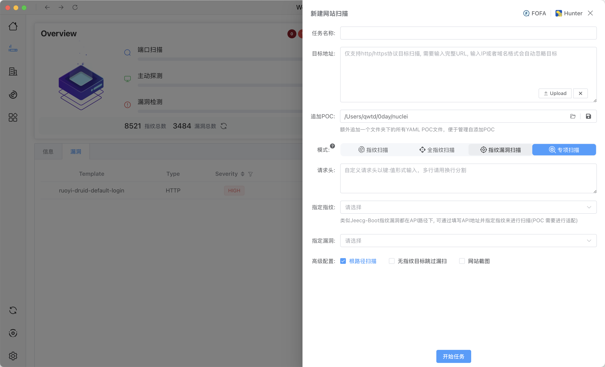

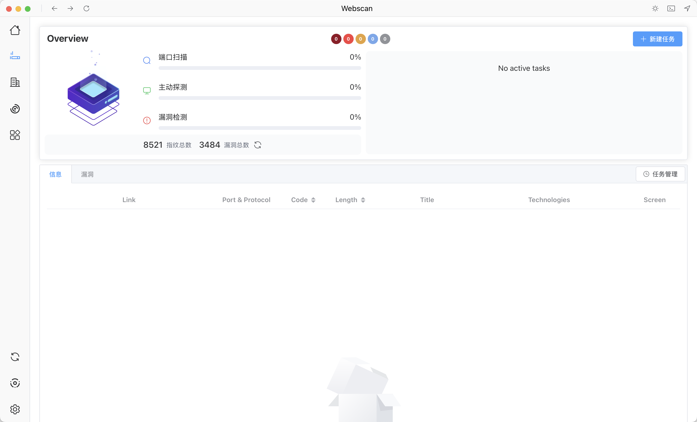

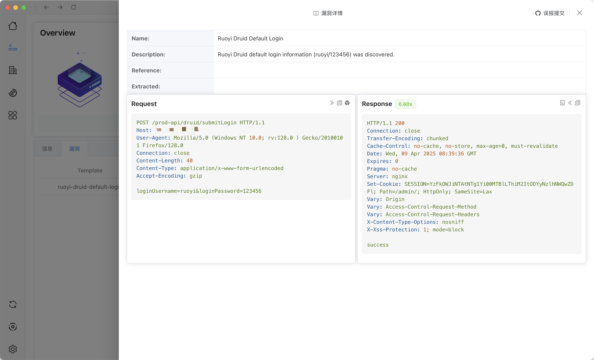

## 目录扫描

完美兼容dirsearch常用参数和supersearchplus的查看响应包功能，以及对重复出现的响应包长度进行了过滤，便于查看。

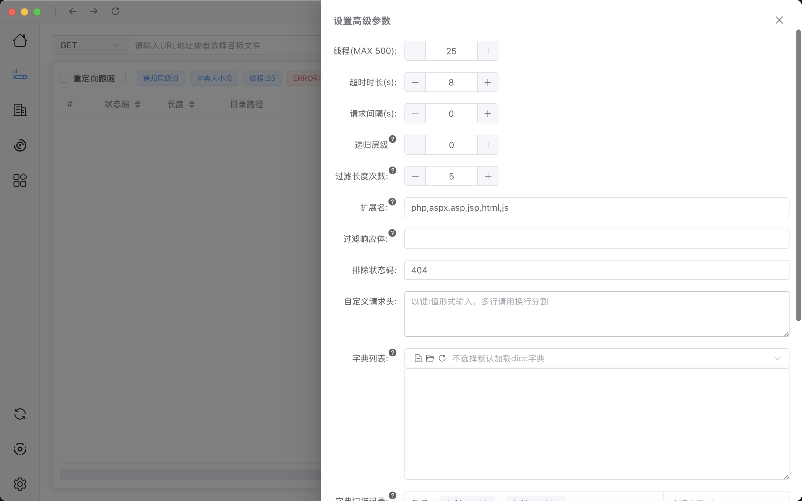

## 公司信息查询

可以通过输入公司名称一步完成IP、域名的收集

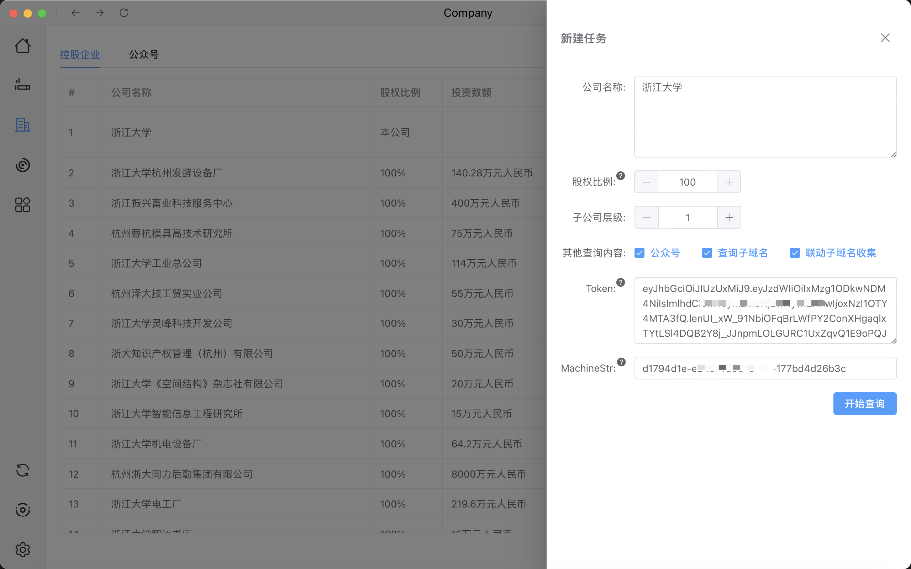

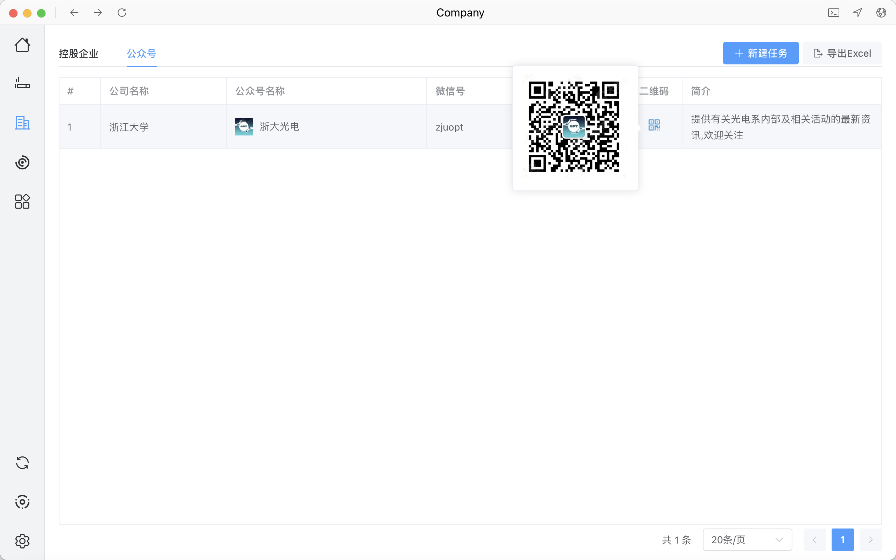

## 空间搜索

`FOFA`、`Hunter`、`Quake`查询功能，保留搜索提示、语法检索、语法收藏以及数据可视性的同时，增加特色功能区，减少数据导出操作。

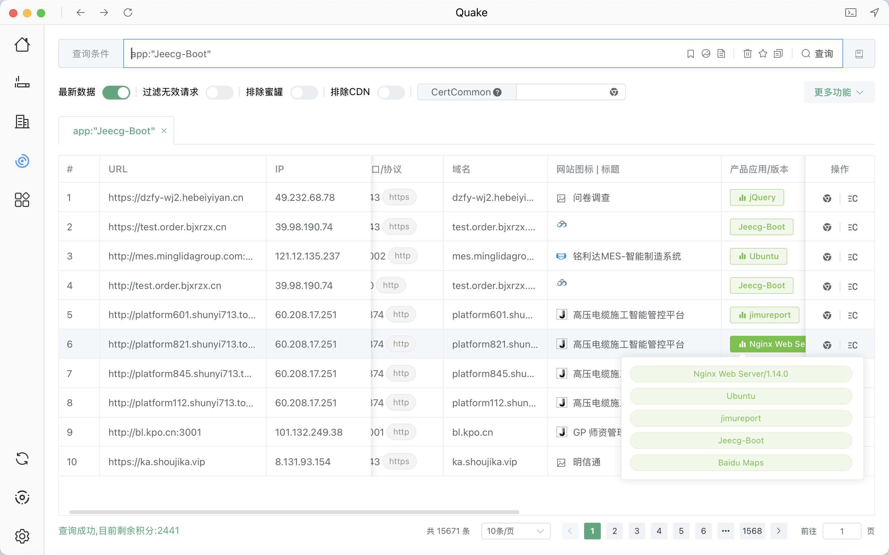

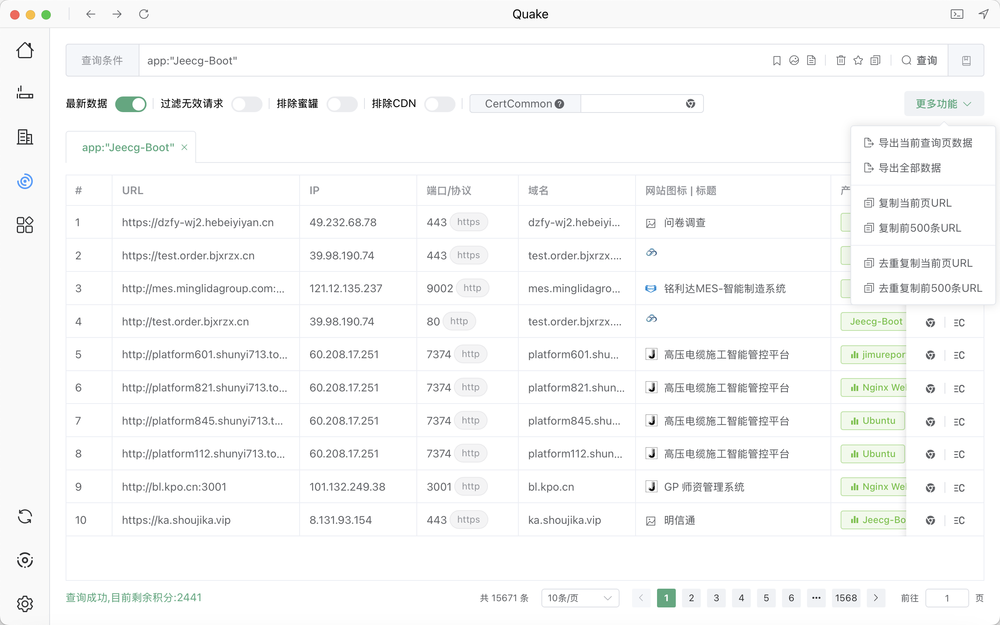

## 数据库自动取样

对敏感列名以及数据内容进行匹配，内容支持身份证、手机号、AKSK信息匹配。

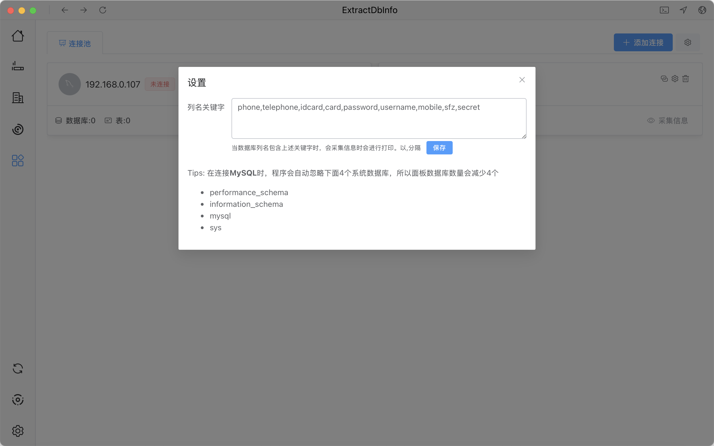

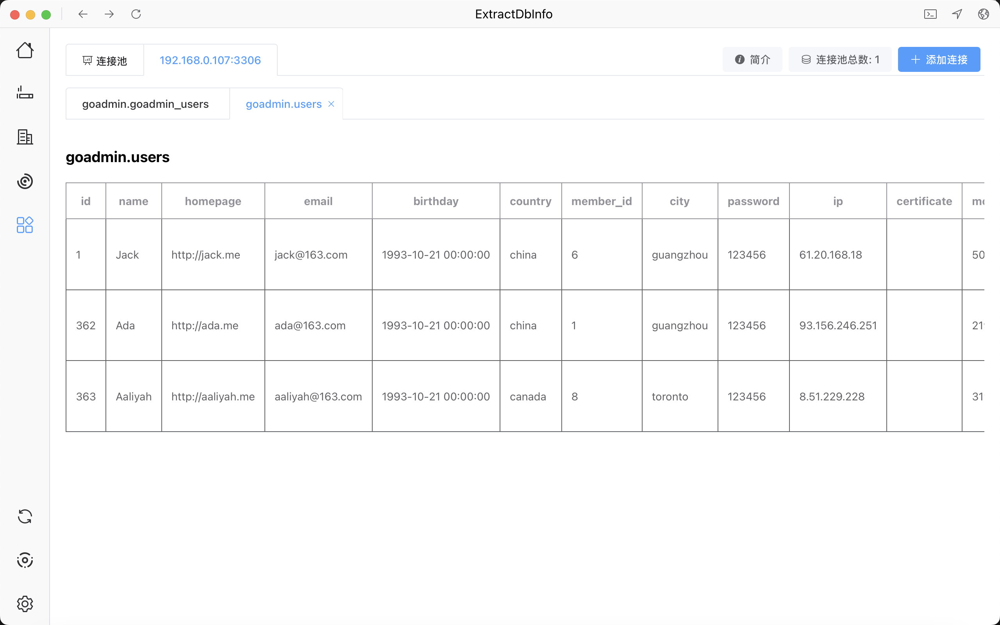

## 加解密模块

可通过下载`CyberChef`集成环境实现本地调用

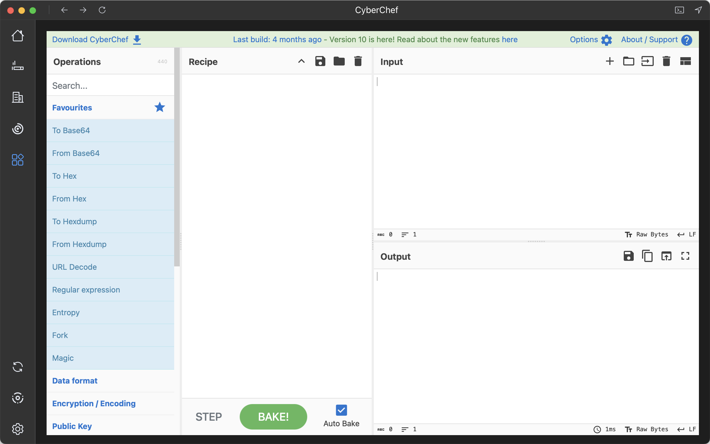

## Fscan&数据处理

针对日常工作中一些常见的数据进行处理，例如提取Fscan结果、提取IP、数据去重、密码解密等

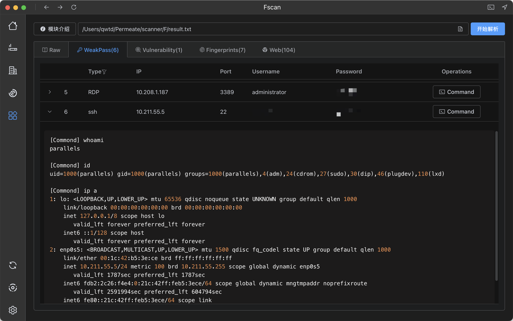

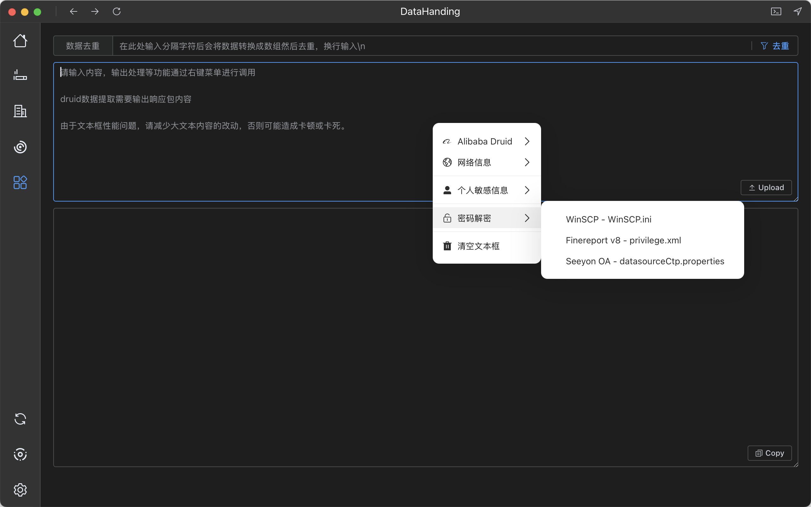

## 应用启动器

用于管理繁琐的脚本，可以自定义启动命令，支持`cmd`打开文件所在命令行、`java`以`java -jar`命令启动`java GUI`应用、`App`打开`exe GUI`

### 联系方式

如果有问题或者好的提议可以Issue提问或者加我联系方式（请备注来意 进群或者问题交流）

## POC贡献者

<table frame=void>
	<tr>
        <td align="center">
            
             
            <a href="https://github.com/onewinner">onewinner</a>
        </td>    
    </tr>
    </table>

# 免责声明

本工具仅面向**合法授权**的企业安全建设行为，如您需要测试本工具的可用性，请自行搭建靶机环境。

为避免被恶意使用，本项目所有收录的poc均为漏洞的理论判断，不存在漏洞利用过程，不会对目标发起真实攻击和漏洞利用。

在使用本工具进行检测时，您应确保该行为符合当地的法律法规，并且已经取得了足够的授权。**请勿对非授权目标进行扫描。**

如您在使用本工具的过程中存在任何非法行为，您需自行承担相应后果，我们将不承担任何法律及连带责任。

在安装并使用本工具前，请您**务必审慎阅读、充分理解各条款内容**，限制、免责条款或者其他涉及您重大权益的条款可能会以加粗、加下划线等形式提示您重点注意。 除非您已充分阅读、完全理解并接受本协议所有条款，否则，请您不要安装并使用本工具。您的使用行为或者您以其他任何明示或者默示方式表示接受本协议的，即视为您已阅读并同意本协议的约束。
