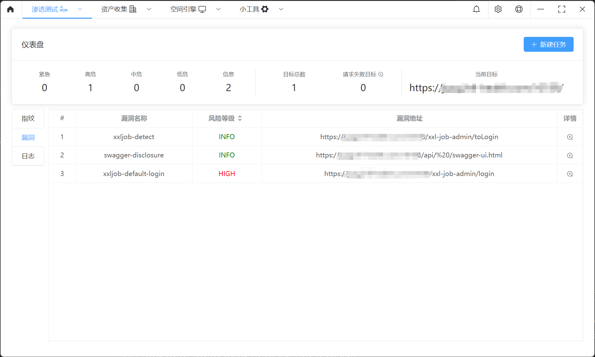
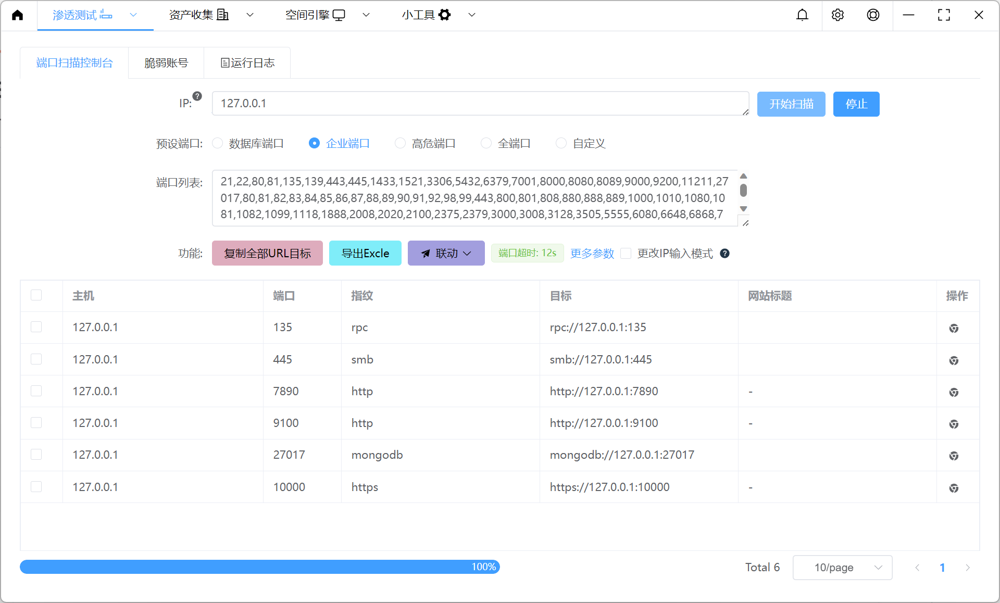
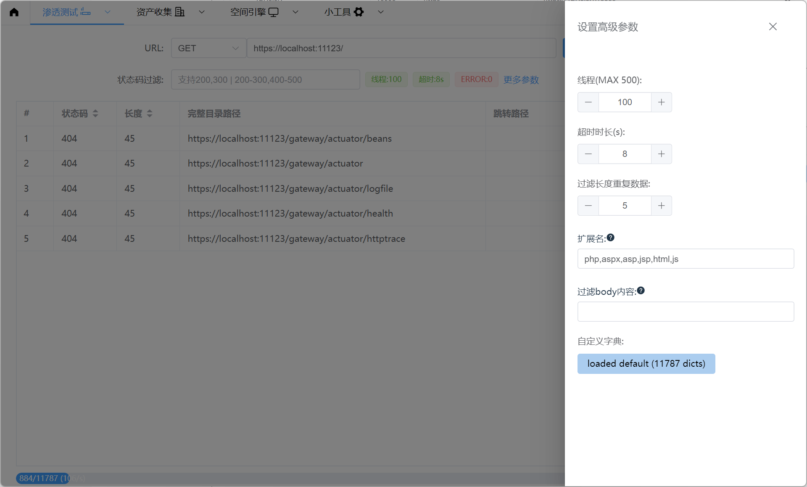
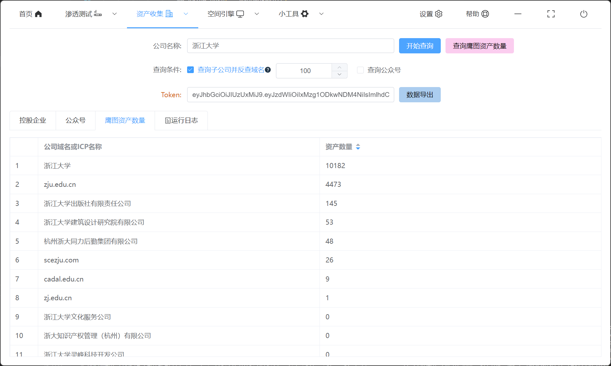
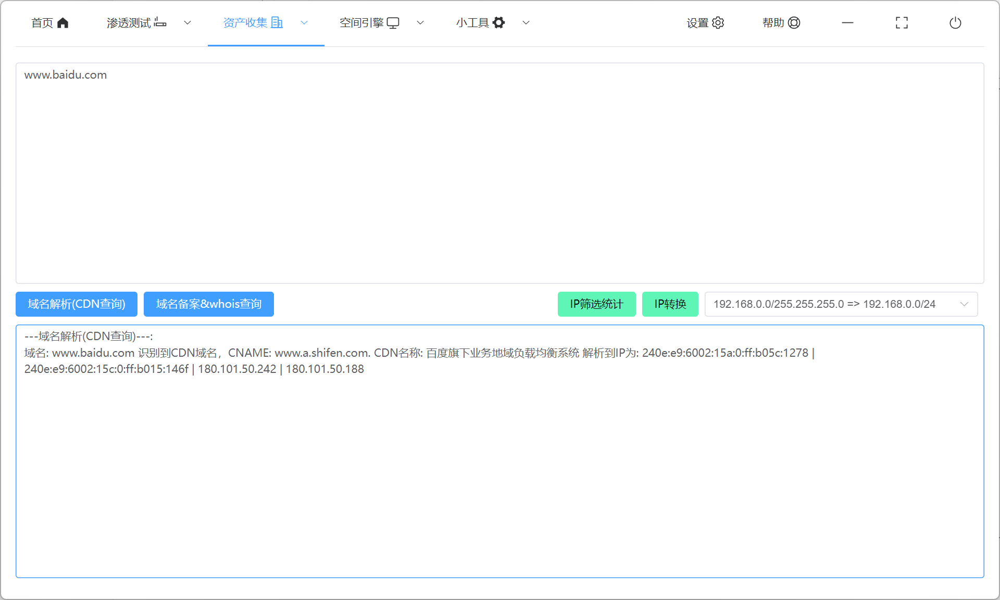
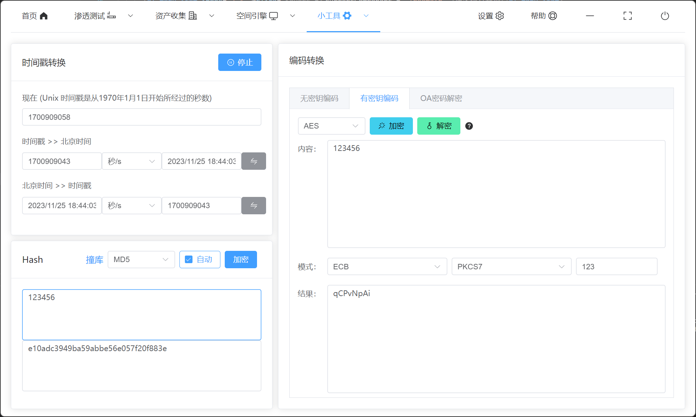
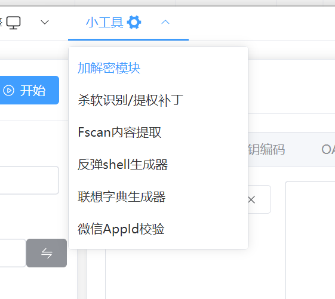

<h4 align="center">由Go Wails实现的GUI工具，功能涵盖网站扫描、端口扫描、企业信息收集、子域名暴破、空间引擎搜索、CDN识别等多功能的工具</h4>

<p align="center">


<a href="https://github.com/qiwentaidi/Slack/releases/">
<a href="https://github.com/qiwentaidi/Slack/releases/">
</p>


# 使用须知

由Fyne到Wails的变迁使用了2个月的时间，功能未全部完善所以暂不提供编译版，后续Fyne版本将停止更新，但是仍然可以通过分支选择你想要查看的模块，本人不太熟悉前端框架，对内存或者功能实现上并不好，欢迎各位师傅提供意见

# 运行

```shell
go install github.com/wailsapp/wails/v2/cmd/wails@latest

wails doctor // 检测是否安装成功

wails dev // 调试

wails build // 编译

编译完的应用在 build/bin 目录下，需要移动到当前目录下运行
```

## 渗透测试

### 网站扫描



### 主机扫描



### 目录扫描



## 资产收集

### 公司名称查资产




### 子域名暴破

### 域名信息查询



## 空间引擎

### FOFA


## 小工具

### 加解密模块等





# 常见问题

Q：`Windows grdp`库无法打包

```
Wails CLI v2.7.1

Executing: go mod tidy
  • Generating bindings: 
  ERROR  
          package slack-wails
                imports slack-wails/core/portscan
                imports github.com/tomatome/grdp/protocol/pdu
                imports github.com/tomatome/grdp/protocol/t125/gcc
                imports github.com/tomatome/grdp/plugin: build constraints exclude all Go files in C:\xx\go\pkg\mod\github.com\tomatome\grdp@v0.1.0\plugin
```

A：

```
1、go env查看CGO_ENABLED是否为1，若不是则go env -w CGO_ENABLED=1 
2、需要安装GCC环境
```


Q：Mac系统下编译成功后更新POC异常或者找不到POC文件夹等

A：由于Mac系统下打包完成为.app文件，需要将其slack-wails.app下面的/Contents/MacOS/slack-wails文件移动到程序根目录下即可正常使用


# 联系方式

如果有问题可以加我联系方式进工具交流群（请备注来意）


# 免责声明

本工具仅面向**合法授权**的企业安全建设行为，如您需要测试本工具的可用性，请自行搭建靶机环境。

为避免被恶意使用，本项目所有收录的poc均为漏洞的理论判断，不存在漏洞利用过程，不会对目标发起真实攻击和漏洞利用。

在使用本工具进行检测时，您应确保该行为符合当地的法律法规，并且已经取得了足够的授权。**请勿对非授权目标进行扫描。**

如您在使用本工具的过程中存在任何非法行为，您需自行承担相应后果，我们将不承担任何法律及连带责任。

在安装并使用本工具前，请您**务必审慎阅读、充分理解各条款内容**，限制、免责条款或者其他涉及您重大权益的条款可能会以加粗、加下划线等形式提示您重点注意。 除非您已充分阅读、完全理解并接受本协议所有条款，否则，请您不要安装并使用本工具。您的使用行为或者您以其他任何明示或者默示方式表示接受本协议的，即视为您已阅读并同意本协议的约束。
