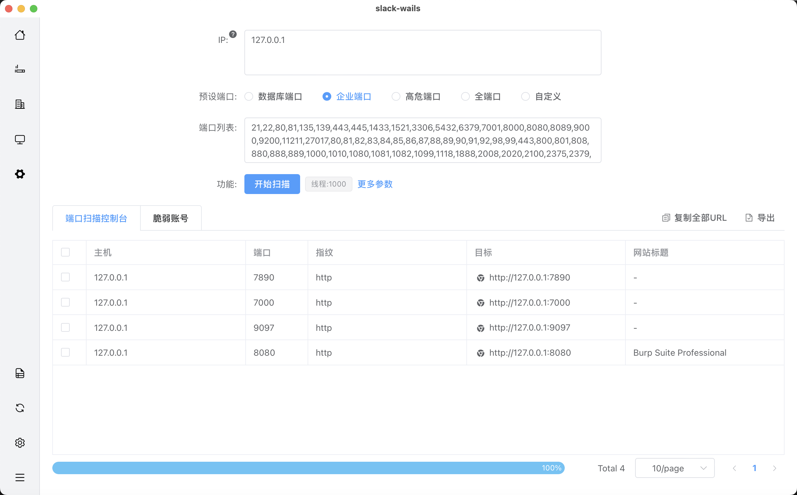
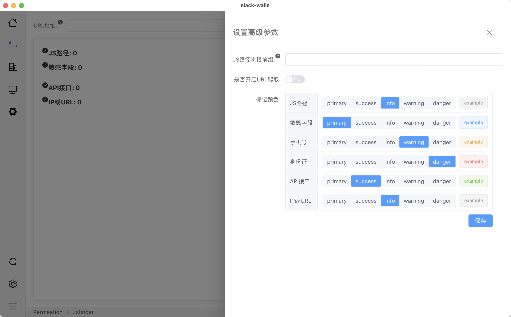
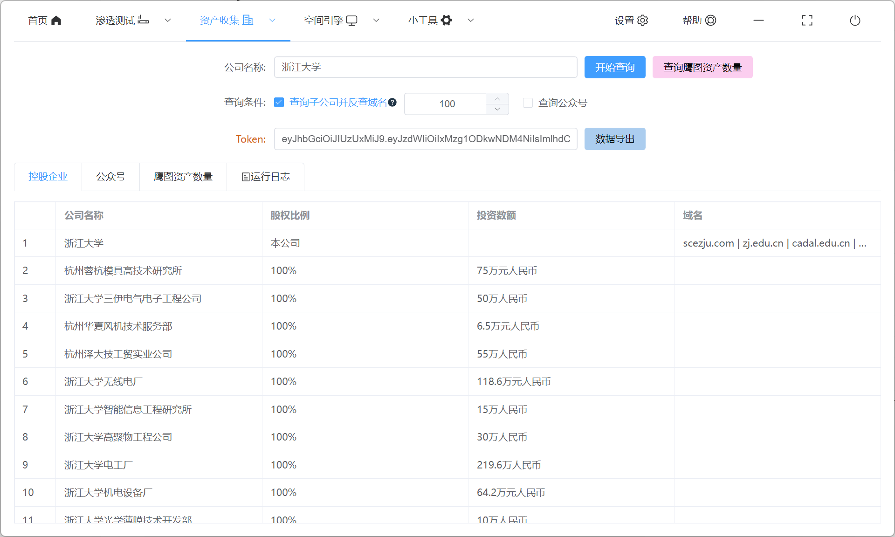
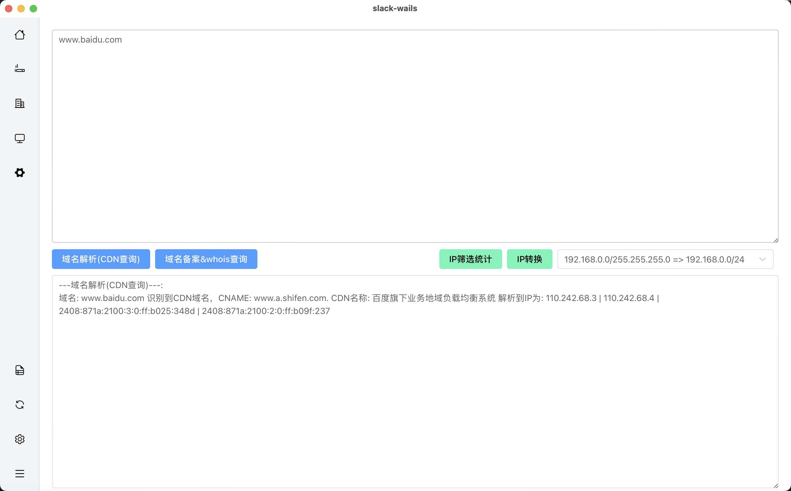
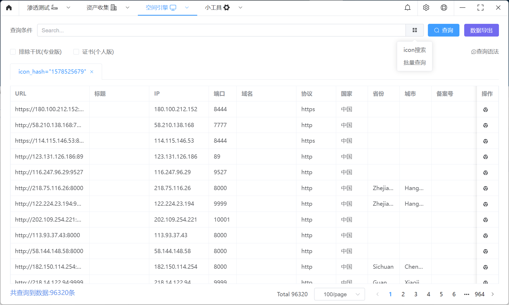
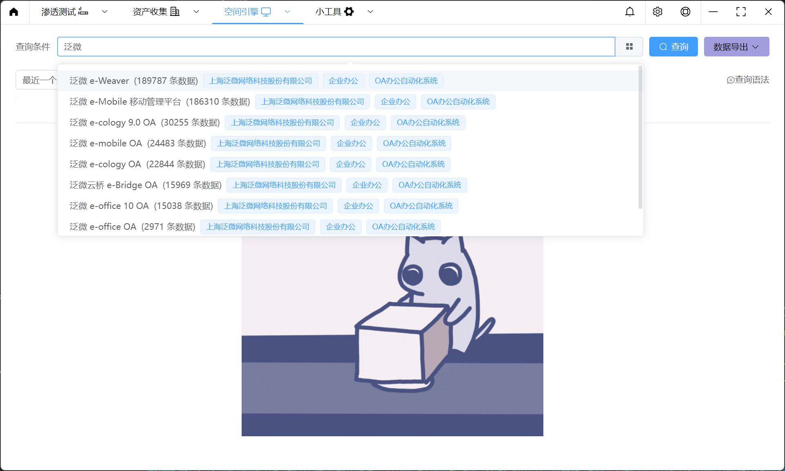
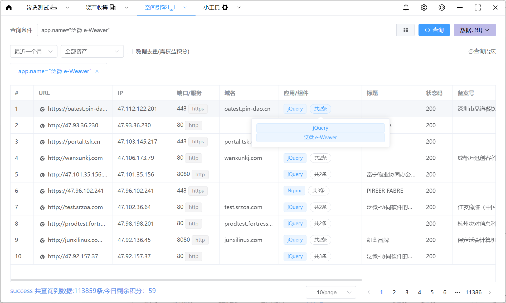
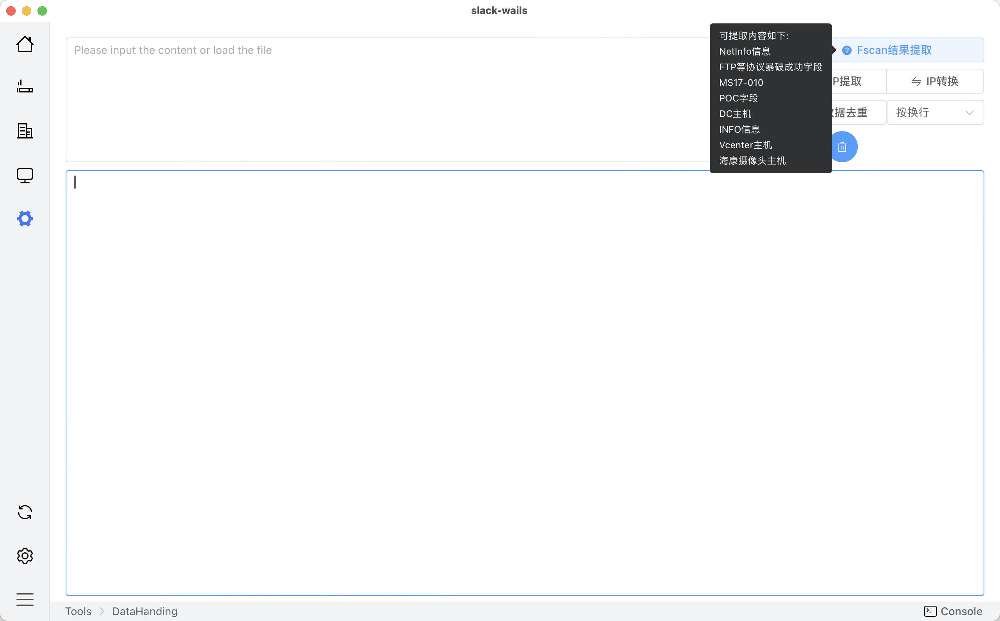

<h4 align="center">一款安服集成化工具平台，希望能让你少开几个应用测试</h4>

<p align="center">


<a href="https://github.com/qiwentaidi/Slack/releases/"></a>
<a href="https://github.com/qiwentaidi/Slack/releases/"></a>
</p>


## 运行

Linux/Debian

```sh
# need install Go 1.20+
sudo apt install golang-go
# need install nodejs 15+
sudo apt install nodejs npm
# install gcc && webkit
sudo apt install build-essential libgtk-3-dev libwebkit2gtk-4.0-dev
# install wails to run app
go install github.com/wailsapp/wails/v2/cmd/wails@latest
git clone https://github.com/qiwentaidi/Slack.git
cd Slack
# choose one, successfully packaged on build/bin
wails dev || wails build
```

Windows

```sh
# need install Go 1.20+ && nodejs 15+
# download gcc(https://sourceforge.net/projects/mingw-w64/) and configure environment variables
go install github.com/wailsapp/wails/v2/cmd/wails@latest
git clone https://github.com/qiwentaidi/Slack.git
cd Slack
# choose one, successfully packaged on build/bin
wails dev || wails build
```

# 渗透测试

## 网站扫描


## 主机扫描



## 目录扫描


## JSFinder




# 资产收集

## 公司名称查资产




## 子域名暴破


## 域名信息查询



# 空间引擎

## FOFA



## 鹰图





# 小工具

## 数据处理



## WeChat


## 常见问题

> Q：Windows grdp库无法打包，出现如下报错
>
> ```
> Wails CLI v2.7.1
> 
> Executing: go mod tidy
> • Generating bindings: 
> ERROR  
>        package slack-wails
>              imports slack-wails/core/portscan
>              imports github.com/tomatome/grdp/protocol/pdu
>              imports github.com/tomatome/grdp/protocol/t125/gcc
>              imports github.com/tomatome/grdp/plugin: build constraints exclude all Go files in C:\xx\go\pkg\mod\github.com\tomatome\grdp@v0.1.0\plugin
> ```
>
> A：
>
> ```
> 1、go env查看CGO_ENABLED是否为1，若不是则go env -w CGO_ENABLED=1 
> 2、需要安装GCC环境
> ```

# 联系方式

如果有问题或者好的提议可以Issue提问或者加我联系方式（请备注来意 进群或者问题交流）


# 免责声明

本工具仅面向**合法授权**的企业安全建设行为，如您需要测试本工具的可用性，请自行搭建靶机环境。

为避免被恶意使用，本项目所有收录的poc均为漏洞的理论判断，不存在漏洞利用过程，不会对目标发起真实攻击和漏洞利用。

在使用本工具进行检测时，您应确保该行为符合当地的法律法规，并且已经取得了足够的授权。**请勿对非授权目标进行扫描。**

如您在使用本工具的过程中存在任何非法行为，您需自行承担相应后果，我们将不承担任何法律及连带责任。

在安装并使用本工具前，请您**务必审慎阅读、充分理解各条款内容**，限制、免责条款或者其他涉及您重大权益的条款可能会以加粗、加下划线等形式提示您重点注意。 除非您已充分阅读、完全理解并接受本协议所有条款，否则，请您不要安装并使用本工具。您的使用行为或者您以其他任何明示或者默示方式表示接受本协议的，即视为您已阅读并同意本协议的约束。
